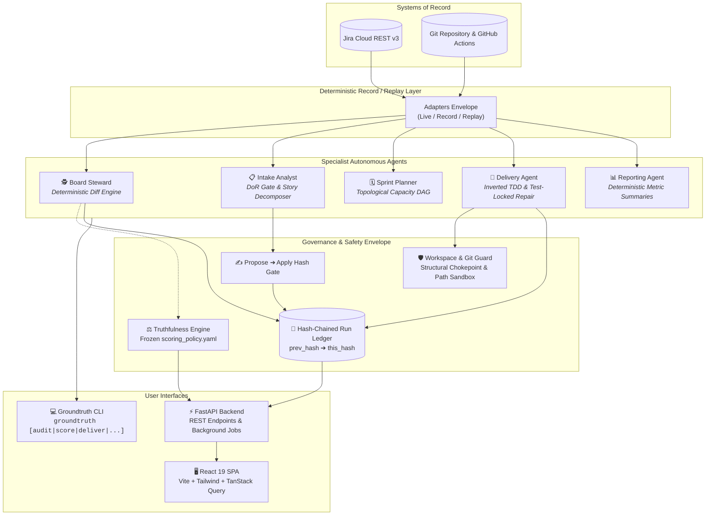

<div align="center">

# ⚖️ GROUNDTRUTH

### **An Autonomous Multi-Agent Governance System That Keeps Jira Boards Honest**

[](https://python.org)
[](https://fastapi.tiangolo.com)
[](https://react.dev)
[](https://www.typescriptlang.org)
[](https://vitejs.dev)
[](https://tailwindcss.com)
[](https://docs.pytest.org)
[](#-mechanical-safety-envelope)

<br/>

> **"Jira records what a team *believes* is happening. Git records what is *actually* happening.<br/>Groundtruth reconciles the gap — with cryptographic proof and zero hallucinated claims."**

<br/>

[Key Features](#-key-features) •
[Architecture](#-system-architecture) •
[The Agent Crew](#-the-specialist-agent-crew) •
[Truthfulness Score](#-the-board-truthfulness-score) •
[Safety Envelope](#-mechanical-safety-envelope) •
[GitHub Releases](#-running-via-github-releases-desktop-app) •
[Configuring APIs in UI](#-configuring-apis-in-the-dashboard-ui) •
[Web Dashboard](#-web-dashboard) •
[Quickstart](#-developer-quickstart-from-source) •
[CLI Reference](#-cli-command-reference)

---

</div>

## 📌 The Problem

Every software engineering organization runs two systems of record that drift apart within days:

| 📋 What Jira Claims | 💻 What Git & CI Actually Prove | 🚨 The Resulting Drift |
| :--- | :--- | :--- |
| **"In Progress"** for 3 weeks | 0 commits on the linked feature branch | **Phantom Progress** (invisible blocker) |
| **"In Progress"** | PR merged to `main` 5 days ago | **Stale Backlog** (work done but uncredited) |
| Ticket doesn't exist | 14 commits merged on branch `feat/billing-fix` | **Orphan Code** (untracked engineering cost) |
| Marked **"Done"** | Acceptance criteria never verified by any test | **Unproven Completion** (accidental regressions) |
| Marked **"Done"** | Bound pytest test is currently failing in CI | **False Green** (broken production build) |
| 3 separate tickets filed | Identical scope filed across three different teams | **Duplicate Overhead** (wasted sprint capacity) |

Reconciling this is manual, exhausting, and endless. Engineering managers and PMs waste days cross-referencing tabs, inspecting branch logs, and chasing developers on Slack.

**Groundtruth automates the entire loop.** It diffs Jira Cloud against Git and GitHub, verifies proof for every claim, and surfaces a deterministic **Board Truthfulness Score (0–100)** with a tamper-evident audit ledger.

---

## ⚡ Key Features

- 🕵️ **Zero-LLM Drift Detection**: Finding merged PRs or stale branches is a factual diff, not a model judgment. The core steward operates without LLMs to eliminate hallucinations.
- 📐 **Board Truthfulness Score (0–100)**: A mathematically grounded, falsifiable score across 5 dimensions with a frozen anti-gaming policy.
- 🔒 **Mechanical Safety Envelope**: Destructive git operations (`git add .`, `commit -a`, `push --force`) are structurally prohibited at the OS/subprocess chokepoint.
- 🛡️ **Cryptographic Hash-Chained Ledger**: Every action, input, output, and approval is recorded in append-only JSONL with SHA-256 block hashing (`prev_hash` $\to$ `this_hash`).
- 🧪 **Inverted TDD Delivery Agent**: Authors tests first from acceptance criteria, mathematically proves red gate failure, locks tests against AI mutation, and repairs code until green.
- 🛑 **Show-Stopping Refusals**: Explicitly declines adversarial code patches that delete assertions and blocks out-of-sandbox git writes.
- 🖥️ **Full-Featured React 19 Dashboard**: Real-time truthfulness gauge, discrepancy drill-down, live agent console, audit timeline, and OAuth settings.
- 📦 **Zero-Dependency GitHub Releases**: Download a single pre-compiled executable containing Python, the FastAPI API, the static React UI, and offline demo fixtures.
- 📼 **100% Offline Replay Engine**: Runs end-to-end demonstrations or test suites with zero external network connectivity using deterministic captured fixtures.

---

## 📦 Running via GitHub Releases (Desktop App)

If you don't want to clone the repo or install Python, Node.js, and dependencies from scratch, you can use the pre-built desktop application released on GitHub.

### 1. Download the Release
1. Navigate to the **[Releases](https://github.com)** page of the repository.
2. Under **Assets**, download the latest standalone binary:
   - **Windows**: `groundtruth.exe`

### 2. Launch the Application
The single-file executable packages the Python runtime, FastAPI server, compiled React 19 dashboard, and bundled demo fixtures:

```powershell
# Double-click groundtruth.exe in File Explorer, or launch from PowerShell:
.\groundtruth.exe
```

- Groundtruth will automatically start the background server and serve the interactive web interface at:
  ```
  http://127.0.0.1:8000
  ```
- Open your browser and navigate to `http://127.0.0.1:8000` to interact with the dashboard immediately.
- The app boots directly into **Demo Mode** with preloaded live snapshots so you can explore the score, discrepancies, and agent runs without configuring any credentials.

### 3. CLI Mode via Release Binary
You can also run any CLI command directly using the release executable:

```powershell
# Run deterministic audit in replay mode
.\groundtruth.exe audit --run-mode replay

# Run score computation
.\groundtruth.exe score --run-mode replay
```

---

## ⚙️ Configuring APIs in the Dashboard UI

Groundtruth includes a dedicated **Settings** page in the dashboard allowing you to add and test your Jira Cloud, GitHub, and LLM credentials directly through the UI — no manual `.env` file editing required!

<div align="center">
  <sub><b>Settings → Live Analysis Readiness</b></sub>
</div>

### 1. Connecting GitHub
1. In the sidebar, click on **Settings** and select the **GitHub** tab.
2. **Auto-Parse URL**: In the **Repository URL** field, paste your repo link:
   ```
   https://github.com/your-organization/your-repo
   ```
3. Click **"Parse"** — Groundtruth automatically extracts and fills the **Owner** and **Repo Name**.
4. **Authenticate**:
   - Paste a GitHub Personal Access Token (PAT) with `repo` scope, **OR**
   - Click **Connect with GitHub (OAuth)** if an OAuth app is configured.
5. Click **"Save GitHub"**.
6. Click **"Test"** — A green badge will confirm that Groundtruth successfully read the commit history and PR statuses.

---

### 2. Connecting Jira Cloud
1. In the **Settings** page, select the **Jira** tab.
2. **Auto-Parse URL**: Paste the link to your Jira project board or software project:
   ```
   https://your-domain.atlassian.net/jira/software/projects/GT/boards/1
   ```
3. Click **"Parse"** — Groundtruth automatically parses and saves the **Site URL** (`https://your-domain.atlassian.net`) and **Project Key** (`GT`).
4. **Authenticate**:
   - Enter your Atlassian account **Email** and your **Jira API Token** (generated from [Atlassian API Tokens](https://id.atlassian.com/manage-profile/security/api-tokens)).
   - Or click **Connect with Jira (OAuth)** if OAuth is enabled.
5. Click **"Save Jira"**.
6. Click **"Test"** — Groundtruth tests the connection against Jira REST API v3 and marks the service as connected.

---

### 3. Configuring your LLM Provider
1. In the **Settings** page, select the **LLM** tab.
2. **Select Provider Preset**: Choose from popular presets:
   - **OpenAI** (sets base URL to `https://api.openai.com/v1`)
   - **Anthropic** (via OpenAI-compatible proxy)
   - **Groq** / **Ollama** / **Custom Endpoint**
3. **Model Name**: Specify the model to use (e.g., `gpt-4o`, `gpt-4o-mini`, `claude-3-5-sonnet`, `deepseek-chat`).
4. **API Key**: Enter your LLM API Key (encrypted and masked in the UI: `••••last4`).
5. Click **"Save LLM"**.
6. Click **"Test"** — Groundtruth performs a test completion to ensure your model and credentials are ready.

> **Readiness Indicator**: Once all 3 connections are verified, the **Live Analysis Readiness** banner at the top of Settings displays **`3 of 3 connected`**, allowing live drift detection and agentic repair on your real repositories!

---

## 🏗 System Architecture



---

## 🤖 The Specialist Agent Crew

Groundtruth divides labor across five specialized agents over a common governance layer:

### 1. 🕵️‍♂️ Board Steward (*The Core Differentiator*)
* **Role**: Continuously audits Jira against Git and GitHub commits, branches, and PRs.
* **Deterministic Core**: **Uses zero LLM calls.** Whether PR #42 is merged or commit `a1b2c3d` exists is an undeniable fact.
* **Non-Empty Evidence Invariant**: A `Discrepancy` cannot be instantiated without external proof (commit SHA, PR link, check-run ID, or changelog timestamp).

```
┌─────────────────────────┬────────────────────────────────────────────────────────┐
│ Detector                │ Verified Condition                                     │
├─────────────────────────┼────────────────────────────────────────────────────────┤
│ STALE_IN_PROGRESS       │ In Progress, but 0 commits in staleness window (7 days)│
│ MERGED_PR_TICKET_OPEN   │ PR merged to default branch, but ticket remains open   │
│ ORPHAN_BRANCH           │ Git branch with commits, but no valid Jira ticket key  │
│ UNVERIFIED_NO_MAPPING   │ Ticket has no bound pytest node IDs in trace manifest  │
│ UNVERIFIED_MAPPING_STALE│ Manifest points to a test that pytest cannot collect   │
│ UNVERIFIED_TEST_FAILING │ Ticket claimed Done, yet its bound pytest test fails   │
│ DUPLICATE_SUSPECTED     │ Token-set Jaccard similarity exceeds threshold (0.45)  │
└─────────────────────────┴────────────────────────────────────────────────────────┘
```

### 2. 📋 Intake Analyst
* **Role**: Converts unstructured input (meeting notes, specs, customer chats) into well-formed backlog stories.
* **Definition of Ready (DoR) Gate**: Programmatically rejects vague tickets (`NO_AC`, `AC_MALFORMED`, `NO_POINTS`).
* **Content-Addressed Idempotency**: Keys tickets on `sha256(source_doc_id + normalized_AC_text)`. Re-running intake never double-creates tickets, even if LLM phrasing changes.
* **Duplicate Detection**: Flags similarity against the open board for human confirmation before filing.

### 3. 🚀 Delivery Agent
* **Role**: Takes an approved ticket and executes inverted Test-Driven Development (TDD).
* **Execution Flow**:
  1. **Branch Isolation**: Checks out an isolated feature branch inside the sandboxed workspace.
  2. **Test Authoring First**: Translates Acceptance Criteria into pytest test cases and records them in `trace_manifest.json`.
  3. **The Red Gate**: Executes tests to prove they fail **with an assertion error** (not an import or syntax blunder).
  4. **Mechanical Test-Lock**: Locks `tests/` with `stat.S_IREAD`, hashes all test files, and enforces AST assertion density.
  5. **Bounded Repair Loop**: Writes code exclusively to `src/`. If the agent attempts to delete a test or reduce assertions to fake a pass, Groundtruth reverts the file and aborts with a `TEST_MUTATION_ATTEMPT` refusal.
  6. **Honest PR Creation**: Generates a GitHub PR body directly from `pytest-json-report`. If tests fail, it honestly opens a **Draft PR** displaying failing checkboxes.

### 4. 📊 Reporting Agent
* **Role**: Generates daily standup digests, sprint health summaries, and score-delta narratives.
* **Fact Isolation**: All statistics, velocities, and score changes are calculated deterministically *before* the LLM generates summary prose.

### 5. 🗓️ Sprint Planner (*Stretch Engine*)
* **Role**: Formulates sprint commitments using historical velocity, dependency DAG topological sorting (with cycle detection), and assignee load-balancing.

---

## ⚖️ The Board Truthfulness Score

The headline metric is a 0–100 score composed of **5 orthogonal dimensions** calculated as explicit fractions ($\frac{\text{numerator}}{\text{denominator}}$) — never bare floats.

$$\text{Score} = 100 \times \sum_{i=1}^{5} \left( w_i \times \frac{\text{Numerator}_i}{\text{Denominator}_i} \right)$$

```
                                  BOARD TRUTHFULNESS
                                       [ 78 / 100 ]
     ┌───────────────────────┬────────────┬─────────────┬─────────────────────────┐
     │ Dimension             │ Weight     │ Ratio       │ External Witness        │
     ├───────────────────────┼────────────┼─────────────┼─────────────────────────┤
     │ ac_validity           │ 15% (0.15) │ 12 / 14     │ Deterministic G-W-T AST │
     │ progress_integrity    │ 20% (0.20) │  4 /  6     │ Commit SHA + Author Date│
     │ done_integrity        │ 35% (0.35) │  8 / 10     │ GitHub CI Check-Run     │
     │ staleness_health      │ 15% (0.15) │ 0.82 / 1.0  │ Jira Changelog History  │
     │ duplication_health    │ 15% (0.15) │ 14 / 15     │ Human-Confirmed Ledger  │
     └───────────────────────┴────────────┴─────────────┴─────────────────────────┘
```

### 🛡️ Why This Metric Cannot Be Gamed
1. **Externally Witnessed**: `done_integrity` requires a passing GitHub Actions check-run conclusion (`gh api`) on the merge SHA. Local test runs cannot attest to done status.
2. **Frozen Anti-Gaming Invariant**:
   $$\text{Weight}(\text{done\_integrity}) \ge \text{Weight}(\text{progress\_integrity}) + \text{Weight}(\text{staleness\_health})$$
   Closing a stalled ticket without a merged PR and passing CI causes a greater loss in `done_integrity` than the points gained by clearing staleness.
3. **Control-Group Isolation**: Groundtruth independently tracks a control group of tickets untouched by agents to demonstrate authentic score improvement.
4. **Frozen Policy Hash**: `scoring_policy.yaml` is version-controlled and its SHA-256 hash is embedded in every score record.

---

## 🛡️ Mechanical Safety Envelope

Groundtruth treats safety as structural code barriers rather than prompt guidance:

### 1. Workspace Isolation (`safety/workspace.py`)
- All write operations are strictly confined to `workspace/`.
- Every git invocation validates that the current directory contains the `.groundtruth-sandbox` sentinel.
- Attempting to target user directories or project roots immediately aborts.

### 2. Git Subprocess Chokepoint (`safety/git_guard.py`)
- `git_guard.py` is the **only** module in the entire codebase allowed to invoke git. A test suite enforces this via AST grep.
- **Strictly Banned Argument Forms**:
  - ❌ `git add .` / `git add -A` / `git add -u`
  - ❌ `git commit -a`
  - ❌ `git clean` / `git reset --hard`
  - ❌ `git push --force`
  - ❌ Any relative `..` pathspec or `shell=True` execution.
- Pins `GIT_DIR` and `GIT_WORK_TREE` environment variables to prevent accidental upward directory traversal.

### 3. Propose $\to$ Apply Workflow (`safety/approval.py`)
- Default execution mode is `--mode dry-run`.
- `--mode propose` writes a cryptographically hashed `ChangeSet` to `artifacts/`.
- `--mode apply` **mandates** providing `--changeset <hash>`, binding human review to the exact byte content before execution.

### 4. Automated Secret Redaction (`safety/redact.py`)
- Automatically sanitizes GitHub PATs (`ghp_`, `gho_`), Jira API tokens (`ATATT`), JWTs, and HTTP Bearer tokens from all logs, ledgers, and LLM prompts.

---

## 🖥️ Web Dashboard

The repository includes a modern web dashboard built with **React 19, Vite, TypeScript, and TailwindCSS**:

```
  web/src/
  ├── components/
  │   ├── layout/       # AppShell, Topbar, Sidebar, MobileNav, DemoBanner
  │   ├── onboarding/   # WelcomeCard, HelpDialog, InfoHint tooltips
  │   ├── score/        # TruthfulnessGauge, ScoreVerdict, DimensionCard
  │   └── agents/       # RunTrigger, JobStatus, ActivityStream
  ├── pages/
  │   ├── Overview.tsx      # High-level Truthfulness score, counters & discrepancies
  │   ├── Discrepancies.tsx # Filterable audit table with direct Jira/GitHub links
  │   ├── Agents.tsx        # Real-time multi-agent execution & trigger console
  │   ├── Integrity.tsx     # Cryptographic ledger inspector & safety guards
  │   ├── Runs.tsx          # Historical execution runs & artifacts browser
  │   └── Settings.tsx      # In-UI API connection management for Jira, GitHub & LLM
  └── lib/
      ├── api.ts            # FastAPI client with structured ApiError handling
      └── nav.ts            # Centralized routes, titles, and metadata
```

---

## 🚀 Developer Quickstart (From Source)

### Prerequisites
- **Python**: `>= 3.13`
- **Node.js**: `>= 20.0` (for web frontend)
- **Git**: Installed and available on system path

### 1. Clone & Environment Setup

```bash
# Clone the repository
git clone https://github.com/your-org/groundtruth.git
cd groundtruth

# Create and activate virtual environment
python -m venv .venv
source .venv/bin/activate       # On Windows: .venv\Scripts\activate

# Install Groundtruth in editable mode with dev & api dependencies
pip install -e ".[api,dev]"
```

### 2. Running Groundtruth in Replay Mode (Zero Tokens)

Groundtruth ships with pre-recorded live payloads so you can run the entire system offline with zero API keys:

```bash
# 1. Run full audit across Jira and Git
groundtruth audit --run-mode replay

# 2. Compute Board Truthfulness Score and print itemized dimensions
groundtruth score --run-mode replay

# 3. Decompose raw notes into Given-When-Then stories with DoR gate
groundtruth intake --run-mode replay fixtures/sample_notes.md

# 4. Generate capacity-checked sprint plan
groundtruth plan --run-mode replay

# 5. Generate daily standup & sprint health report
groundtruth report --run-mode replay
```

### 3. Launching the Web Dashboard & API

You can run the FastAPI backend and React frontend concurrently:

```bash
# Terminal 1: Launch FastAPI Backend (Port 8000)
python -m groundtruth.api

# Terminal 2: Launch Vite Dev Server (Port 5173)
cd web
npm install
npm run dev
```

Visit **`http://localhost:5173`** to access the interactive dashboard.

---

## 💻 CLI Command Reference

All CLI commands default to safe `--mode dry-run`.

```bash
Usage: groundtruth [OPTIONS] COMMAND [ARGS]...

Options:
  --mode [dry-run|propose|apply]  Execution mode (default: dry-run)
  --run-mode [live|record|replay] Adapter I/O mode (default: replay)
  --changeset TEXT                Changeset hash (required for --mode=apply)
  --help                          Show this message and exit.

Commands:
  audit    Emit discrepancies between Jira and Git with evidence links.
  score    Compute Board Truthfulness Score + evidence log + control group.
  intake   Decompose raw prose/notes into structured, DoR-verified stories.
  deliver  Run inverted TDD delivery on a ticket (Branch ➔ Red ➔ Green ➔ PR).
  plan     Run capacity-checked sprint planning with dependency DAG sort.
  report   Generate standup digest, sprint health, and score-delta narrative.
  seed     Populate synthetic messy Jira board and Git repository history.
  reset    Tear down synthetic board and clean sandbox workspace.
```

### Propose $\to$ Apply Example
```bash
# Step 1: Propose intake from meeting notes
groundtruth --mode propose intake notes.md
# Output: Proposed changeset a8f9b2c3d4... (3 items).

# Step 2: Review changeset, then apply with the exact hash
groundtruth --mode apply --changeset a8f9b2c3d4... intake notes.md
```

---

## 🧪 Test Suite & Falsifiability

Groundtruth includes 36 test suites verifying safety, anti-gaming invariants, and deterministic replay:

```bash
# Run the entire test suite
pytest

# Verify the Board Truthfulness Anti-Gaming suite
pytest tests/test_score_antigaming.py

# Verify the Structural Git Safety Chokepoint & Home Directory Guard
pytest tests/test_safety_guard.py tests/test_git_chokepoint.py

# Verify the AST Test-Lock & Repair Integrity
pytest tests/test_test_lock.py tests/test_repair.py tests/test_red_gate.py

# Verify the Cryptographic Ledger Hash Chain
pytest tests/test_ledger_chain.py
```

---

## 📂 Repository Layout

```
├── .github/                     # GitHub Actions workflows & CI configs
├── artifacts/                   # Run directories: ledger.jsonl, scores, trace manifests
├── fixtures/                    # Deterministic JSON payloads for replay mode
├── scoring_policy.yaml          # Frozen policy weights with sha256 fingerprint
├── pyproject.toml               # Python package metadata & dependencies
├── groundtruth.spec             # PyInstaller desktop executable configuration
├── src/
│   └── groundtruth/
│       ├── __main__.py          # Unified CLI entry point
│       ├── config.py            # Environment configuration & execution modes
│       ├── contracts/           # Pydantic v2 data models (Evidence, Story, Discrepancy)
│       ├── adapters/            # Jira REST, GitHub CLI, GitLog, LLM (Record/Replay)
│       ├── agents/              # Steward, Intake, Delivery, Reporting, Planner
│       ├── detectors/           # Pure discrepancy detection rules
│       ├── delivery/            # Test authoring, Red-Gate, Test-Lock, Repair loop
│       ├── ledger/              # Cryptographic hash-chained ledger reader & writer
│       ├── safety/              # WorkspaceGuard, GitGuard, Secret Redactor, Approval
│       ├── scoring/             # 5D Truthfulness score engine & anti-gaming proof
│       ├── trace/               # Manifest generation & pytest node ID reconciliation
│       └── api/                 # FastAPI server, OAuth routes & background jobs
├── web/                         # Modern React 19 + TypeScript + Tailwind SPA
└── tests/                       # 36 comprehensive test suites & anti-gaming verification
```

<div align="center">
  <sub>Built with rigorous engineering for transparent, verifiable agentic workflows.</sub>
</div>
